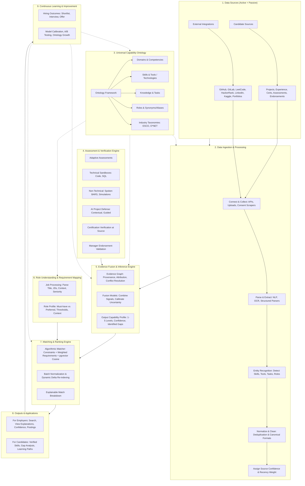
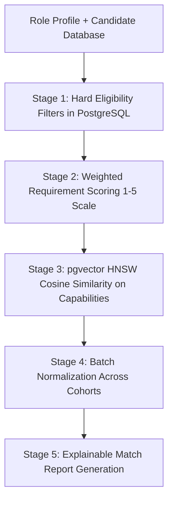

# SmartKiwi Intelligent Talent Discovery Platform Architecture
## End-to-End System & Intelligence Architecture

This document formalizes the complete architecture of the **SmartKiwi Intelligent Talent Discovery Platform** as modeled in the foundational MindMap specification.

---

## 1. Data Sources (Active + Passive)

SmartKiwi ingests evidence across two synchronized source streams:

### A. Candidate Sources (Direct Platform Submissions)
- **Projects:** Individual and collaborative engineering projects with author contribution metrics.
- **Work Experience:** Full-time, part-time, and internships with corporate supervisor verification.
- **Certifications & Licenses:** Direct credentials with issuing authority identifiers.
- **Skill Assessments:** Proctored diagnostic evaluations across cognitive and technical levels.
- **Endorsements:** Verified corporate peer and manager endorsements via single-use expiring cryptographic tokens.
- **Profile Information:** Verified university enrollment, departmental affiliation, and academic honors.

### B. External Integrations (Third-Party Platforms)
- **GitHub / GitLab:** Repository activity, commit signatures, pull requests, AST code structure.
- **LeetCode / HackerRank:** Problem-solving frequency, runtime efficiency percentiles, algorithm proficiencies.
- **LinkedIn:** Employment chronology, role descriptions, enterprise networks.
- **Kaggle:** Machine learning competition ranks, public datasets, reproducible notebook models.
- **Public Portfolios:** Technical blog posts, whitepapers, open-source documentation.

---

## 2. Data Ingestion & Processing Pipeline

The ingestion layer turns raw artifacts into structured, trusted evidence nodes:

1. **Connect & Collect:** Secure OAuth integrations, authenticated REST/GraphQL API connections, drag-and-drop file uploads (PDF, DOCX, ZIP), and authorized scrapers operating strictly with candidate consent.
2. **Parse & Extract:** Multi-modal OCR and layout-aware parsers extract structured text from unstructured documents.
3. **Entity Recognition:** Specialized NER and transformer classification models detect canonical skills, tools, programming languages, tasks, and role titles.
4. **Normalize & Clean:** Removes duplicates, standardizes casing and synonyms, resolves syntactic variants to canonical ontology records.
5. **Assign Source Confidence:** Calculates an initial source trust score based on provenance authenticity, recency decay, and verification state.

---

## 3. Universal Capability Ontology

The shared language of capabilities across SmartKiwi:

- **Ontology Hierarchy:**
  - `Domain` (e.g. Engineering, Marketing, Finance).
  - `Competency` (e.g. Distributed Systems, Problem Solving, Financial Modeling).
  - `Skill` (e.g. Python, Docker, PostgreSQL, React).
  - `Tool / Technology` (e.g. FastAPI, Tailwind, Redis, Kafka).
  - `Knowledge` (e.g. Concurrency Controls, Data Structures, Indian DPDP Act).
  - `Task` (e.g. Implement JWT Auth, Build Microservice, Train NER Model).
  - `Role` (e.g. Backend Platform Engineer, Full Stack Developer).
- **Relationships:** Typed links including `requires`, `related-to`, `demonstrated-by`, `alternative-to`, and `sub-skill-of`.
- **Taxonomy Crosswalks:** Bi-directional mapping to international standards including **ESCO** (European Skills, Competences, Qualifications and Occupations) and **O*NET**.

---

## 4. Assessment & Verification Engine

Provides multi-dimensional active validation:

- **Adaptive Assessments:** Dynamic item selection adapting to the candidate's proficiency level in real time.
- **Technical Sandboxes:** Isolated, non-networked Docker execution sandboxes (256 MB / 1 CPU / 5 s timeout) for coding challenges and SQL schema execution.
- **Non-Technical Simulations:** Spoken response evaluations graded against Behaviorally Anchored Rating Scales (BARS) using Claude with automated Gemini failover.
- **AI Project Defense Interview:** Contextual, guided defense simulation interrogating architectural design choices, code diffs, and trade-offs.
- **Certification Authority Verification:** Real-time API verification against Credly, AWS, Google Cloud, and university SIS registries.
- **Endorsement Validation:** Corporate domain verification with circular collusion detection algorithms.

---

## 5. Evidence Fusion & Inference Engine

Synthesizes multiple disparate signals into an inspectable capability profile:

### Evidence Graph Operations
- Links verified evidence nodes to canonical capability records.
- Preserves immutable provenance and author attribution.
- Resolves conflicting claims (e.g. conflicting employment dates or contradictory assessment scores).
- Applies recency decay weightings (recent demonstrable work carries higher confidence).

### Fusion Models & Output Capability Profile
- **Proficiency Estimation:** Computes a discrete proficiency score on a calibrated **1 to 5 scale**:
  - *Level 1 — Novice / Foundational Knowledge*
  - *Level 2 — Advanced Beginner / Applied Practical*
  - *Level 3 — Competent / Independent Execution*
  - *Level 4 — Proficient / Advanced Problem Solving & Defense*
  - *Level 5 — Expert / Architectural Mastery & Capstone*
- **Calibrated Confidence Indicators:** Reports certainty ($0.00$ to $1.00$) reflecting volume and independence of backing evidence.
- **Gap Detection & Recommendations:** Automatically highlights unevidenced requirement areas and suggests targeted assessments to unlock higher proficiency tiers.

---

## 6. Role Understanding & Requirement Mapping

Converts unstructured job postings into structured employer demand profiles:

1. **Job Parsing:** Ingests job titles, department contexts, experience requirements, and raw JD descriptions.
2. **Entity Extraction:** Separates requirements into:
   - **Must-Have Constraints:** Mandatory skills, certifications, minimum proficiency thresholds, and graduation criteria.
   - **Preferred Qualifications:** Value-add skills, secondary tools, and bonus competencies.
3. **Role Profile Generation:** Formats demand into an inspectable JSON schema with role-specific weighting vectors and context tags (e.g. internship vs. senior full-time).

---

## 7. Matching & Ranking Engine

Operates on deterministic, cost-optimized algorithmic principles without open-ended LLM guessing:

### Key Technical Mandates (October 2026)
- **Zero LLM Dependency in Ranking:** Eliminates compute bottlenecks and token expenses by replacing generative LLM matchers with formulaic weighted scoring and `pgvector` embeddings.
- **Batch Normalization:** Normalizes scores across cohorts to prevent grade inflation or temporal scoring drift.
- **Dynamic Delta Recomputation:** When a student upgrades proficiency or a new candidate registers, an event-driven BullMQ worker recomputes matching deltas rather than re-running the entire database.

---

## 8. Outputs & Applications

### For Employers & Recruiters
- **Intelligent Talent Search:** Search and discover pre-verified candidates with sub-second query latency.
- **Inspectable Match Explanations:** Clear breakdown showing exact requirement-level alignment, verified evidence backing, and identified gaps.
- **Talent Pool Pipeline:** Shortlist candidates, export structured dossiers, and dispatch interview invitations.

### For Candidates & Students
- **Verified Capability Profile:** A living, tamper-evident digital credential backed by cryptographic SHA-256 signatures and QR verification links.
- **Actionable Gap Analysis:** Clear visibility into which skills are holding back candidate matches for target roles.
- **Targeted Assessment Recommendations:** Suggestions for specific evaluations that resolve high-impact capability gaps.

---

## 9. Continuous Learning & Platform Infrastructure

### Continuous Feedback Loops
- Tracks downstream hiring outcomes (shortlists, interviews, offers, retentions) to recalibrate scoring weights.
- Expands the capability ontology automatically through human-reviewed cluster proposals.
- Runs continuous A/B testing and Cohen's κ reliability audits on automated evaluators.

### Cross-Cutting Platform Infrastructure
- **Data Storage:** High-performance PostgreSQL with `pgvector` HNSW indexing, Redis caching (with mandatory TTLs), and PgBouncer connection pooling.
- **Security & Privacy:** Compliant with Indian DPDP Act 2023. Explicit consent, zero Aadhaar/PAN collection, 30-day proctoring snapshot purge, and AES-256 encryption at rest.
- **Scalability:** Hosted on a Single High-End Linux VPS with automated Blue-Green Caddy zero-downtime deployments, ready for seamless multi-region cloud migration.
