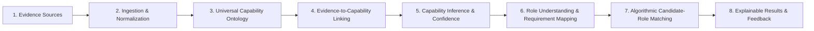

# HireKiwi R&D Workstream Blueprint
## Research, Architecture Decisions, Experiments, and Readiness Criteria

**Purpose:** A foundational working document for the HireKiwi R&D team to investigate, decide, prototype, and validate intelligence capabilities before full-scale implementation.

> **Document Status:** Authoritative Working Blueprint  
> **Release Target:** October 2026 (Sprints 7 & 8)  
> **System Architect:** Tino (`@brittytino`)  
> **Version:** 1.0  
> **Last Updated:** 4 October 2026

---

## 1. R&D Objective

Establish a reliable, defensible chain from raw active and passive evidence to capability understanding, and from capability understanding to explainable candidate–role matching.

The objective is **not** to build an unwieldy skills database, a black-box deep learning model, or an arbitrary composite score for its own sake. The objective is to determine whether HireKiwi can produce **defensible, useful, and reproducible explanations** of why available evidence supports a candidate’s fit for a particular role.

### Core Intelligence Pipeline

### Conceptual Separation (Anti-Hallucination Guardrails)

- **Ontology:** The shared language and structure for describing capabilities (Domain, Competency, Skill, Tool, Knowledge, Task, Role).
- **Evidence Model:** The representation of claims, sources, artifacts, verification, and provenance.
- **Inference Engine:** The deterministic and probabilistic process estimating what evidence supports regarding capability levels.
- **Role Intelligence:** The process converting a job description into structured requirements.
- **Matching Engine:** The deterministic algorithmic comparison between candidate profiles and role requirements.
- **Decision:** The human or organizational action taken using outputs (never delegated fully to an automated model).

---

## 2. Workstream 1 — Product Intelligence Definition

**Goal:** Define exactly what HireKiwi’s intelligence must understand and produce.

### Research and Decision Areas
- **Intelligence Objective:** Skill discovery, capability verification, proficiency estimation (1–5 scale), role fit, and inspectable candidate ranking.
- **Unit of Evaluation:** Individual skills, competencies, tasks, and role-specific capability profiles.
- **Supported Users:** Candidates, recruiters, hiring managers, and university placement offices (TPOs).
- **Evidence Scope:** Active demonstrations (assessments, code sandboxes, spoken BARS, defense interviews) and passive history (work experience, projects, certifications, GitHub, LeetCode, manager endorsements).
- **Intelligence Boundaries:** Descriptive profiles, calibrated confidence indicators, and explainable recommendations. No automated rejections.
- **Explainability:** Evidence-linked explanations, confidence indicators, and explicit missing-evidence notices.

---

## 3. Workstream 2 — Universal Capability Ontology

**Goal:** Design a consistent, extensible representation of what people can do, know, and use.

### Entity & Relationship Model
- **Entity Types:** Domain, Competency, Skill, Tool/Technology, Knowledge, Task, Role.
- **Relationship Types:** `requires`, `related-to`, `demonstrated-by`, `alternative-to`, `sub-skill-of`.
- **Hybrid Ontology Architecture:** Canonical relational catalog in PostgreSQL for core entities, combined with graph-like adjacency relationships and vector embeddings for semantic lookup.
- **External Taxonomies:** ESCO and O*NET crosswalks.
- **Proficiency Levels:** Standardized 1–5 scale with behaviorally anchored definitions.

---

## 4. Workstream 3 — Evidence Model & Evidence Quality

**Goal:** Define what counts as evidence and how evidence supports or fails to support a capability claim.

### Five Distinct Concepts
1. **Claim:** What a candidate or source states they can do.
2. **Evidence:** Material artifact or telemetry that may support the claim.
3. **Verification:** Source checks performed on the evidence (AST scan, issuer check, manager token).
4. **Inference:** What the system concludes regarding capability level and confidence.
5. **Decision:** What an employer or recruiter does with that conclusion.

*These concepts must never be collapsed into a single field or opaque score.*

---

## 5. Workstream 4 — Data Ingestion, Extraction, and Entity Resolution

**Goal:** Convert varied source material into consistent, attributable, machine-readable records.

### Extraction Pipeline
- **Input Formats:** Resumes (PDF/DOCX), structured forms, GitHub/GitLab repositories, LeetCode profiles, institutional SIS feeds.
- **Structured Extraction:** Schema-constrained extraction with deterministic validation rules.
- **Entity Resolution:** Canonical dictionary matching, alias resolution, and vector embedding lookup.
- **Source Provenance:** Source URL/file hash, timestamp, validator signature, and model version.

---

## 6. Workstream 5 — Assessment & Capability Verification

**Goal:** Determine when existing evidence is sufficient and when targeted assessment improves confidence.

### Multi-Tier Assessment Surface
- **L1:** Foundation Knowledge (MCQ / numeric).
- **L2:** Applied Practical (Code sandbox, SQL executor).
- **L3:** Spoken Response (Audio analysis via Claude BARS).
- **L4:** Interactive Defense Simulation (Real-time technical questioning).
- **L5:** Capstone Project (Checklist, rubric, presentation).

---

## 7. Workstream 6 — Capability Inference & Intelligence Engine

**Goal:** Infer capability levels from multiple signals while representing uncertainty honestly.

### Critical Principle
**Confidence is not proficiency.** A candidate may possess verifiable evidence of using Python without establishing Level 4 proficiency. The system must report the skill with calibrated confidence while explicitly noting unevidenced higher levels.

---

## 8. Workstream 7 — Role Understanding & Requirement Mapping

**Goal:** Convert job descriptions into structured capability requirements.

### Key Outputs
- Extraction of **must-have vs. preferred** skills, competencies, and tools.
- Proficiency threshold definitions (1–5 scale).
- Role context identification (seniority, industry, work setting).
- Recruiter override and editing controls.

---

## 9. Workstream 8 — Matching & Ranking Engine

**Goal:** Compare structured role profiles with candidate profiles and produce explainable shortlists.

### Algorithmic Matching Design (October Mandate)
- **Zero LLM Hallucinations:** Matching algorithms must be deterministic and transparent.
- **Three-Stage Staged Pipeline:**
  1. *Hard Filters (SQL):* Location, work authorization, minimum graduation year, privacy discoverability.
  2. *Weighted Requirement Scoring:* Requirement-level matching against validated proficiency thresholds.
  3. *Semantic Vector Retrieval:* `pgvector` HNSW cosine similarity for semantic capability alignment.
- **Batch Normalization:** Candidate match scores are normalized across batches to eliminate cohort drift.
- **Dynamic Re-indexing:** Real-time delta updates triggered when a student advances proficiency or registers.

---

## 10. Workstream 9 — Deep Learning & Model Strategy

**Goal:** Apply learned models where measurable advantages exist; preserve deterministic rules elsewhere.

- Supervised NLP/transformer token classification for skill extraction.
- Deterministic formulas for score aggregation and cutoffs.
- Claude + Gemini failover circuit breaker via AI Gateway (`@hirekiwi/ai-gateway`).

---

## 11. Workstream 10 — Evaluation, Benchmarking & Reliability

**Goal:** Continuous evaluation against annotated golden datasets before deployment.

- Grounding checks: Extracted skills verified against source text.
- Cohen's κ inter-rater reliability monitor for automated evaluation (pause scoring if κ < 0.65).
- Cronbach's α internal consistency tracking per specialization track.

---

## 12. Workstream 11 — System Architecture & Data Contracts

**Goal:** Modular, robust service boundaries across the monorepo.

- Monorepo packages: `@hirekiwi/contracts`, `@hirekiwi/scoring-engine`, `@hirekiwi/prompts`, `@hirekiwi/ui`, `@hirekiwi/api-client`.
- Backend services: Fastify + NestJS in `apps/api-core`.
- Asynchronous orchestration: BullMQ delayed queues and Kafka event bus (`smart.*`).
- Single High-End VPS with Blue-Green Caddy proxy and PgBouncer connection pooling.

---

## 13. Workstream 12 — Governance, Privacy & Responsible Use

**Goal:** Adherence to DPDP Act 2023 and ethical talent discovery.

- Explicit user consent for active evaluations and passive scrapers/APIs.
- Downsampled proctoring snapshots with automated 30-day purge.
- Zero collection of sensitive identifiers (No Aadhaar or PAN stored in DB).
- Dual human review accountability for flagged integrity incidents.

---

## 14. Major Architecture Decisions Summary

| Decision | Selected Strategy | Rationale |
| --- | --- | --- |
| **Ontology** | Hybrid Relational + Graph | Combines relational query performance with semantic relationship traversal |
| **Matching Engine** | Deterministic Algorithmic + pgvector | Prevents LLM hallucinations and slashes operational inference cost |
| **Job ID Format** | Incremental Structured IDs | Replaces legacy 32-bit format for clean multi-tenant indexing |
| **Mobile Auth** | 1 Mobile = 1 Account | Prevents duplicate student registrations and credential fraud |
| **Human Review** | Dual Model (College / Platform) | Aligns institutional accountability with independent student protection |

---

## 15. R&D Experiment Backlog (Spikes)

| ID | Experiment / Spike | Core Question | Deliverable | Priority |
| --- | --- | --- | --- | --- |
| **SPIKE-OCT-01** | Algorithmic Matching vs LLM Cost & Hallucination | Can transparent weighted matching + pgvector match LLM quality at 1/100th cost? | Benchmark evaluation script & report | High |
| **SPIKE-OCT-02** | Universal Capability Ontology Schema | How to structure canonical skills with ESCO/O*NET crosswalks in PostgreSQL? | Prisma schema & seed catalog | High |
| **SPIKE-OCT-03** | 4D Telemetry & DL Pipeline Validation | How to validate multidimensional proctoring telemetry reliably? | Validation pipeline & unit tests | High |
| **SPIKE-OCT-04** | Dynamic Profile Re-indexing & Batch Normalization | How to re-index candidate matches efficiently upon proficiency upgrades? | Event consumer & delta worker | High |

---

## 16. R&D Ownership Model

- **System Architect:** Tino (`@brittytino`)
- **Platform Core & DB:** Vishal V (`@vis465`)
- **Experience Layer:** Satheswaran V (`@Satheshwaran26`)
- **Assessment Lifecycle & Trust:** Vishal Bharath R (`@vishalbharath`)
- **AI Gateway & Matching:** Ramansh (`@Ram9012`)
- **Data Spine & Ontology:** Vedika G (`@11vedikaa`)

---

## 17. Readiness Criteria

Before moving intelligence features to GA:
- [x] Clear first-release intelligence objective and role scope defined.
- [x] Hybrid ontology specification and Skill Inventory schema drafted.
- [x] Deterministic algorithmic matching pipeline validated against recruiter shortlists.
- [x] Dual human-review workflow established and integrated.
- [x] Auth token refresh and rate-limiting hardened on student endpoints.
- [x] 1 Mobile = 1 Account uniqueness enforced in database.
