# AI-DLC: AI-Driven Software Delivery Lifecycle
## From OpenSpec to AI-DLC: The Delivery-First Paradigm

> **Framework Status:** Active Engineering Doctrine  
> **System Architect:** Tino (`@brittytino`)  
> **Core Principle:** *"The hardest part of AI coding was never generation — it was delivery."*

---

## 1. Why OpenSpec Wasn't Enough: The Generation vs. Delivery Trap

In the first phase of AI coding, engineering teams believed that the solution to AI reliability was **Spec-Driven Development (OpenSpec)**: write thorough, comprehensive specifications in Markdown, feed them to LLMs, and watch them build the product.

In practice, that model broke down when scaling to multi-engineer production teams:
- **The Code Generation Illusion:** Modern LLMs (Claude 3.5/3.7 Sonnet, Gemini 2.5 Flash/Pro) can generate hundreds of lines of syntactically valid code in seconds ("vibe coding").
- **The Delivery Bottleneck:** Speed of generation does not equal speed of delivery. Generated code often fails on edge cases, breaks cross-module contracts, creates silent regressions, and produces code no human or subsequent AI session understands.
- **The Knowledge Gap:** Over time, the human context—the *"why"* behind architectural trade-offs—is lost. Teams struggle to differentiate between intentional design choices and accidental hallucinations.

**AI-DLC (AI-Driven Software Delivery Lifecycle)** re-engineers the software engineering process around the reality that **the primary code executor is an AI model**, supervised by human domain leads and gated by a mechanical System Architect.

```mermaid
flowchart TD
    subgraph Traditional["Legacy SDLC"]
        H1[Human Writes Code] --> H2[Slow Generation] --> H3[Manual Review]
    end

    subgraph OpenSpec["OpenSpec Trap"]
        OS1[Human Writes Static Spec] --> OS2[AI Generates Code Instantly] --> OS3[Massive Verification Debt & Hallucinations]
    end

    subgraph AIDLC["AI-DLC Closed Loop"]
        D1[Architect Contract Gate] --> D2[Machine-Actionable Micro-Ticket]
        D2 --> D3[AI Agent Executes via MCP]
        D3 --> D4[Deterministic Test & Typecheck Gate]
        D4 --> D5[Bounded PR & Automated CI Merge]
    end
```



---

## 2. The Five Non-Negotiable Pillars of AI-DLC

### Pillar 1: Machine-Executable Ticket Units (Zoho Sprints MCP → Claude)
Tickets in AI-DLC are not loose human notes. Each ticket is a **self-contained, machine-executable unit of work** structured for AI agents:
1. **Bounded Context:** Explicit list of files the AI is permitted to touch.
2. **Context & Problem Statement:** The exact business and architectural "why".
3. **Contract / Interface Spec:** The precise Zod schema, DTO, or Prisma model.
4. **Input Pre-conditions:** Starting state and dependencies.
5. **Output Acceptance Criteria:** Measurable, unambiguous outcomes.
6. **Deterministic Verification Command:** The exact terminal command (`pnpm typecheck`, `pnpm --filter <app> test:unit`) the AI must run and observe green before opening a PR.

### Pillar 2: Contract-First Architectural Gates (`@hirekiwi/contracts`)
AI models hallucinate parallel data transfer objects and subtle payload divergences when allowed to write frontend and backend concurrently. In AI-DLC:
- Cross-module interfaces originate exclusively in `packages/contracts`.
- Only the System Architect (`@brittytino`) merges changes to `@hirekiwi/contracts`.
- Frontend (`packages/api-client`) and Backend (`apps/api-core`) engineers pull the merged type package and build in parallel against immutable types.

### Pillar 3: Deterministic Mechanical Verification (Zero Status Theatre)
In AI-DLC, an agent or engineer is not allowed to say *"it looks good"*. Verification is mechanical:
- `pnpm lint`: Zero ESLint warnings allowed.
- `pnpm typecheck`: Strict TypeScript checking with zero `any` across boundaries.
- `pnpm test:unit`: Unit tests passing with coverage thresholds.
- `pnpm format:check`: Prettier formatting strictly checked.
- If a verification command fails, the AI must diagnose the terminal trace and fix the defect before requesting review.

### Pillar 4: Bounded Diff Limits (&lt;400 Lines of Code per PR)
AI models tend to introduce code sprawl and refactor adjacent files needlessly. AI-DLC mechanically enforces:
- Maximum **400 lines of non-generated hand-written code** per pull request.
- Exactly **one ticket per pull request**.
- Large diffs are rejected automatically by CI bot before human review.

### Pillar 5: Context Preservation & Living Documentation (Mandatory Agent Updates)
To eliminate the Knowledge Gap:
- Authoritative documentation is maintained exclusively in `@hirekiwi/web-docs` (Fumadocs portal on port 3006/3026).
- **Mandatory Agent Doc Updates:** Whenever an agent or engineer implements a ticket, their AI agent MUST update the relevant documentation in `@hirekiwi/web-docs` as part of the PR. A ticket PR is incomplete without its corresponding documentation update.
- **Documentation Verification Gate:** Before opening any PR, the agent must run:
  ```bash
  pnpm --filter @hirekiwi/web-docs build
  ```
  and verify all pages compile cleanly with zero errors.
- Every PR title references its ticket: `feat(matching): dynamic delta re-indexing (SK-RA-037)`.
- Architectural choices are captured in Architecture Decision Records (`docs/adr/`).

---

## 3. The AI-DLC Developer & Agent Workflow

```mermaid
sequenceDiagram
    autonumber
    actor Engineer as Developer (Vibe Coding)
    participant MCP as Zoho Sprints MCP
    participant Agent as Claude / Cursor Agent
    participant Repo as Local Monorepo
    participant Docs as Web-Docs SSOT
    participant Gate as CI & Architect Gate

    Engineer->>MCP: Pull assigned Ticket ID (e.g. SK-VV-001)
    MCP-->>Agent: Ingest Machine-Actionable Spec & Constraints
    Agent->>Repo: Create feature branch (feat/SK-VV-001-slug)
    Agent->>Repo: Implement scoped changes in owned bounded context
    Agent->>Docs: Update corresponding web-docs pages with changes
    Agent->>Repo: Run mechanical verification (pnpm test:unit && pnpm typecheck)
    Agent->>Docs: Verify documentation build (pnpm --filter @hirekiwi/web-docs build)
    alt Verification Fails
        Agent->>Agent: Parse terminal error, patch code/docs, re-verify
    else Verification Passes
        Agent->>Repo: Commit conventional commit message
        Agent->>Gate: Open PR to dev branch (<400 lines)
        Gate-->>Engineer: Automated CI check passes; Module Owner merges
    end
```

---

## 4. Product Identity vs. Agent Persona: HireKiwi & Vivi

To prevent team and agent confusion:
- **Product & Platform Name:** **HireKiwi Intelligent Talent Discovery Platform** (formerly known under working prototypes as HireKiwi).
- **AI Agent Persona:** **Vivi** is the unified AI agent, proctoring supervisor, and candidate copilot (do NOT rename Vivi to HireKiwi).
  - Vivi conducts interactive project defense interviews and asks code-grounded questions.
  - Vivi supervises 4D proctoring and provides non-invasive candidate prompts.
  - Vivi guides students through personalized skill-gap assessments and learning pathways.
  - Implementation-wise, Vivi is powered by modular backend services in `apps/api-core` and our unified AI Gateway with strict prompt guardrails (no phantom autonomous agent loops).

---

## 5. Single Linux VPS Port Architecture

All environments run on a single Linux VPS managed via isolated Docker Compose projects with Caddy TLS reverse proxy:

| Service / Application | Production Blue | Production Green | Dev (`dev.hirekiwi.online`) | Local Host | Description |
| :--- | :--- | :--- | :--- | :--- | :--- |
| `apps/api-core` | `:3000` | `:3010` | `:3020` | `http://localhost:3000` | Fastify + NestJS Backend API Core |
| `apps/web-student` | `:3001` | `:3011` | `:3021` | `http://localhost:3001` | Next.js 16 Student Assessment & Profile Portal |
| `apps/web-tpo` | `:3002` | `:3012` | `:3022` | `http://localhost:3002` | Next.js 16 University / TPO Cohort Portal |
| `apps/web-admin` | `:3003` | `:3013` | `:3023` | `http://localhost:3003` | Next.js 16 Super Admin & Review Console |
| `apps/web-verify` | `:3004` | `:3014` | `:3024` | `http://localhost:3004` | Next.js 16 Public Verification & Credential Portal |
| `apps/web-auth` | `:3005` | `:3015` | `:3025` | `http://localhost:3005` | Next.js 16 Unified Auth & Invitation Portal |
| `apps/web-company` | `:3006` | `:3016` | `:3026` | `http://localhost:3006` | Next.js 16 Employer / Recruiter Company Portal |
| `apps/web-landing` | `:3007` | `:3017` | `:3027` | `http://localhost:3007` | Next.js 16 Public Marketing Landing Site |
| `apps/web-docs` | `:3008` | `:3018` | `:3028` | `http://localhost:3008` | Next.js 16 Fumadocs Documentation SSOT |
| `apps/proctoring-cv` | `:8091` | `:8092` | `:8093` | `http://localhost:8091` | Python CV Proctoring Sidecar (YuNet/YOLO) |
| PostgreSQL | `127.0.0.1:5432` | `127.0.0.1:5432` | `127.0.0.1:5432` | `127.0.0.1:5432` | Relational Store with `pgvector` HNSW |
| PgBouncer | `127.0.0.1:6432` | `127.0.0.1:6432` | `127.0.0.1:6432` | `127.0.0.1:6432` | Transaction Pooling Gateway |
| Redis | `127.0.0.1:6379` | `127.0.0.1:6379` | `127.0.0.1:6379` | `127.0.0.1:6380` | Token bucket, sliding-window rate limit, cache |
| Kafka / Redpanda | `127.0.0.1:19092` | `127.0.0.1:19092` | `127.0.0.1:19092` | `127.0.0.1:19092` | Event bus for asynchronous telemetry & delta updates |
| MinIO S3 | `127.0.0.1:9000` | `127.0.0.1:9000` | `127.0.0.1:9000` | `127.0.0.1:9000` | S3 Object Storage API (Console: `:9001`) |

> [!IMPORTANT]
> **Week 1 Milestone Target:** For Week 1 (Oct 05 - Oct 11, 2026), we are **NOT moving to production**. The deliverable deadline on Friday (Oct 09) targets an end-to-end deployment to the **Dev environment (`dev.hirekiwi.online`)** on ports `3020-3028` for internal stakeholder validation, sprint review demo, and stability handover.

---

## 6. Why AI-DLC Enables 300+ Tickets in 5 Days

When specifications are ambiguous, AI generation creates chaos: circular bugs, infinite loops, and merge conflicts. 

Under AI-DLC:
- Each engineer executes **12 machine-actionable micro-tickets per day**.
- Because every ticket has an explicit file list, contract definition, verification command, and doc update requirement, the AI agent completes the implementation, updates docs, executes tests, and opens the PR in 15–30 minutes with zero hallucination.
- Across 5 engineers and 5 days, the team delivers **300+ validated, production-grade micro-features and hardening fixes** without compromising system architecture.
