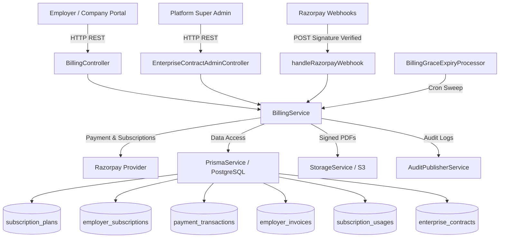
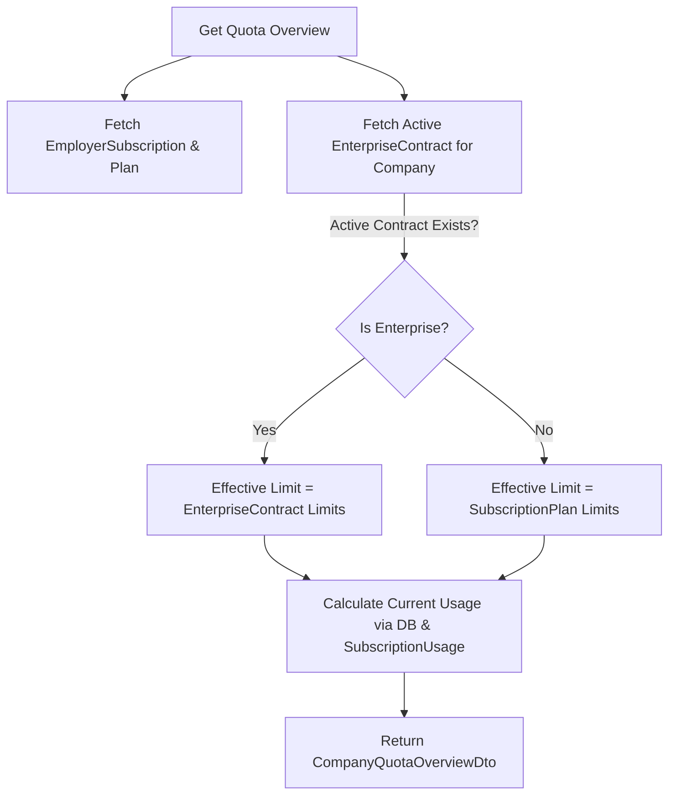
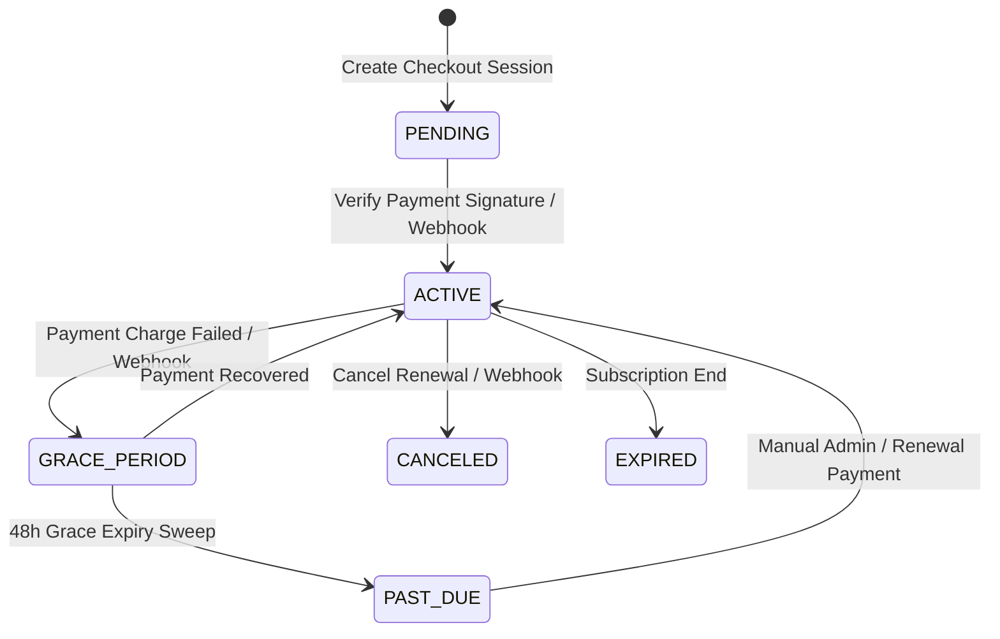
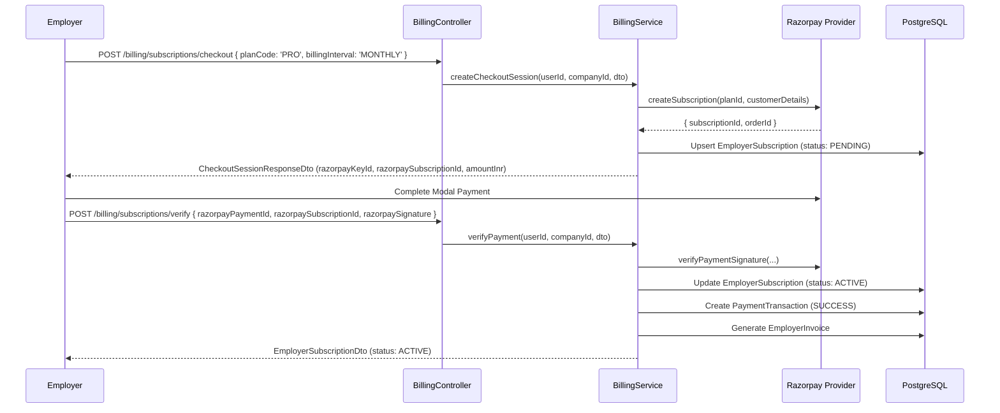
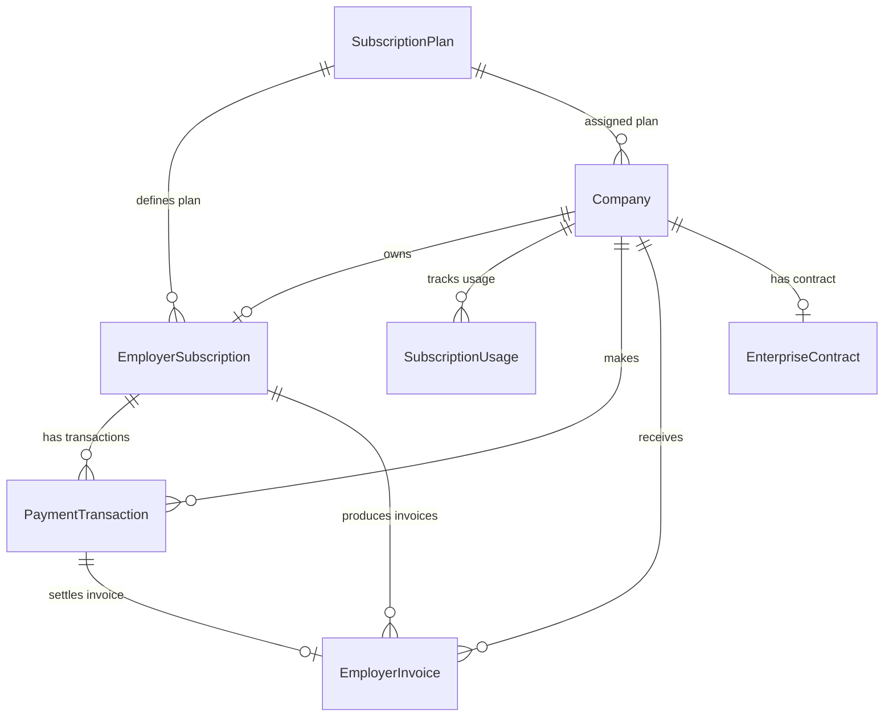

# HireKiwi Employer Plans & Billing

Technical documentation for employer subscriptions, payments, invoices, quotas, grace periods, and enterprise contracts.

---

## 1. Executive Overview

The HireKiwi Employer Plans & Billing subsystem provides B2B monetization, subscription management, entitlement resolution, quota enforcement, and enterprise contract capabilities for employer organizations.

Key capabilities:

- **Subscription Management**: Supports standard self-service tiers (**FREE**, **BASIC**, **PRO**) and custom **ENTERPRISE** contracts.
- **Provider Integration**: Seamless billing execution powered by **Razorpay Subscriptions & Webhooks**.
- **Quota & Entitlement Engine**: Server-side enforcement of usage dimensions including Active Jobs, Candidate Searches, Direct Messages, and Employer Seats.
- **Grace Period & Failure Recovery**: 48-hour controlled grace periods for failed renewals managed by background BullMQ processors.
- **Enterprise Contracts**: Admin-gated lifecycle for custom contract terms and override quotas.
- **Invoicing & Compliance**: Immutable financial invoice records with GSTIN snapshotting, tax calculations, and secure PDF storage link generation.

---

## 2. Architecture Overview



### Core Subsystem Components

1. **`BillingController`**: Exposes employer-facing subscription endpoints, checkout sessions, invoice retrieval, quota overviews, payment method updates, and public webhook ingestion under `/api/v1/billing`.
2. **`EnterpriseContractAdminController`**: Super-Admin gated controller under `/api/v1/admin/billing/enterprise-contracts` for enterprise contract drafting, listing, approval, and termination.
3. **`BillingService`**: Central domain service orchestrating subscription state transitions, entitlement resolution, quota assertions, Razorpay payment verification, webhook reconciliation, and invoice generation.
4. **`RazorpayProvider`**: Adapter handling API calls to Razorpay for subscription creation, updates, cancellations, and HMAC SHA256 webhook/payment signature verification.
5. **`BillingGraceExpiryProcessor`**: BullMQ queue worker executing periodic sweeps to transition expired grace period subscriptions (`GRACE_PERIOD`) to `PAST_DUE`.

---

## 3. Employer Plans

Plan definitions are stored in the `subscription_plans` database table and backed by the `PlanCode` domain enum (`FREE`, `BASIC`, `PRO`, `ENTERPRISE`).

| Plan Name                     | Internal Code | Price (INR)     | Billing Interval | Description                                                                  |
| ----------------------------- | ------------- | --------------- | ---------------- | ---------------------------------------------------------------------------- |
| **Get Started**               | `FREE`        | ₹0 / mo         | N/A              | Entry-level plan automatically assigned upon employer verification.          |
| **Find & Engage**             | `BASIC`       | Configured rate | Monthly / Annual | Tier 1 paid plan for growing talent search needs.                            |
| **Build Talent Pipelines**    | `PRO`         | Configured rate | Monthly / Annual | Tier 2 paid plan for high-volume recruitment.                                |
| **Talent Intelligence Suite** | `ENTERPRISE`  | Custom          | Custom / Annual  | Custom enterprise contract with custom pricing and tailored quota overrides. |

---

## 4. Plan Configuration

Each `SubscriptionPlan` model configures default capacity limits across key operational dimensions:

```prisma
model SubscriptionPlan {
  id                   String                 @id @default(uuid()) @db.Uuid
  code                 PlanCode               @unique
  name                 String
  candidateCapacity    Int?                   @map("candidate_capacity")
  priceInr             Int?                   @map("price_inr")
  isCustomPrice        Boolean                @default(false) @map("is_custom_price")
  maxActiveJobs        Int?                   @map("max_active_jobs")
  maxCandidateSearches Int?                   @map("max_candidate_searches")
  maxDirectMessages    Int?                   @map("max_direct_messages")
  maxEmployerSeats     Int?                   @map("max_employer_seats")
  createdAt            DateTime               @default(now()) @map("created_at") @db.Timestamptz(6)
}
```

- **`priceInr`**: Whole INR base price (e.g., `7500` = ₹7,500). `null` for FREE or custom plans.
- **`isCustomPrice`**: Flagged `true` for `ENTERPRISE` plans requiring manual administrative contracts.

---

## 5. Quota Model

Usage and entitlements are evaluated across four distinct dimensions:

| Quota Dimension          | Usage Source                                         | Limit Source                     | Reset / Period Behavior        | Enforcement Point                    |
| ------------------------ | ---------------------------------------------------- | -------------------------------- | ------------------------------ | ------------------------------------ |
| **`ACTIVE_JOBS`**        | Count of `JobOpening` where `status = 'OPEN'`        | Enterprise Contract > Plan Limit | Current state (non-cumulative) | `JobService` creation & publishing   |
| **`CANDIDATE_SEARCHES`** | `SubscriptionUsage.candidateSearchesCount`           | Enterprise Contract > Plan Limit | Resets each billing period     | Search API endpoints                 |
| **`DIRECT_MESSAGES`**    | `SubscriptionUsage.directMessagesCount`              | Enterprise Contract > Plan Limit | Resets each billing period     | `MessagingService.startConversation` |
| **`EMPLOYER_SEATS`**     | Count of active `User` records linked to `companyId` | Enterprise Contract > Plan Limit | Current state (non-cumulative) | `CompanyTeamService` invite/add user |

### Quota Enforcement Flow

```typescript
// Called server-side prior to executing gated actions
await billingService.assertQuotaAvailable(companyId, 'ACTIVE_JOBS');

// Increments period-based usage counters post-action
await billingService.incrementUsage(companyId, 'DIRECT_MESSAGES', 1);
```

If limit is exceeded or subscription status is inactive (`PAST_DUE`, `CANCELED`, `EXPIRED`), a `403 Forbidden` (`quota_exceeded` / `subscription_inactive`) exception is thrown.

---

## 6. Entitlement Resolution

The `BillingService.getCompanyQuotaOverview` method dynamically resolves effective entitlements based on active contracts and subscriptions:



### Limit Resolution Precedence

1. **Active Enterprise Contract**: If a valid `EnterpriseContract` exists (`startDate <= now <= endDate`), its custom limits override all plan defaults (`null` indicates unlimited).
2. **Subscription Plan Defaults**: Used when no active enterprise contract override is present.
3. **Default Hardcoded Fallbacks**: Applied if plan configuration fields are unconfigured.

---

## 7. Subscription Lifecycle

The `EmployerSubscription` entity moves through explicit status states (`EmployerSubscriptionStatus`):



| Status             | Description                                               | Capabilities Allowed                       |
| ------------------ | --------------------------------------------------------- | ------------------------------------------ |
| **`PENDING`**      | Checkout initiated, awaiting payment confirmation.        | Free plan defaults                         |
| **`ACTIVE`**       | Payment verified; active subscription in good standing.   | Full plan quota access                     |
| **`GRACE_PERIOD`** | Payment failure occurred; 48-hour recovery window active. | Full plan quota access retained            |
| **`PAST_DUE`**     | Grace period expired without payment recovery.            | Read-only access; quota operations blocked |
| **`CANCELED`**     | Subscription explicitly canceled by user/provider.        | Read-only access upon period end           |
| **`EXPIRED`**      | Subscription period completed without renewal.            | Fallback to FREE plan entitlements         |

---

## 8. Starting a Paid Plan (Checkout Flow)



### Security & Validation Rules

- Direct checkout for **`FREE`** plan is rejected (`invalid_plan_for_checkout`).
- Direct checkout for **`ENTERPRISE`** plan is rejected (`enterprise_contact_required`).

---

## 9. Razorpay Integration

Razorpay serves as the primary payment processor for recurring subscription management.

### Configured Environment Variables (`env.ts`)

| Environment Variable          | Required | Description                           | Example Placeholder      |
| ----------------------------- | -------- | ------------------------------------- | ------------------------ |
| `RAZORPAY_KEY_ID`             | Optional | Razorpay API Key ID                   | `rzp_test_...`           |
| `RAZORPAY_KEY_SECRET`         | Optional | Razorpay API Secret                   | `&lt;configured secret>` |
| `RAZORPAY_WEBHOOK_SECRET`     | Optional | Webhook Signature Verification Secret | `&lt;configured secret>` |
| `RAZORPAY_PLAN_ID_BASIC`      | Optional | Provider Plan ID for BASIC tier       | `plan_Basic123`          |
| `RAZORPAY_PLAN_ID_PRO`        | Optional | Provider Plan ID for PRO tier         | `plan_Pro456`            |
| `RAZORPAY_PLAN_ID_ENTERPRISE` | Optional | Provider Plan ID for ENTERPRISE tier  | `plan_Ent789`            |
| `BILLING_TAX_RATE_PERCENT`    | Optional | Configured GST Tax Rate (e.g. `18`)   | `18`                     |

### Provider Mapping Logic

The `resolveRazorpayPlanId(planCode)` helper maps internal plan codes (`BASIC`, `PRO`, `ENTERPRISE`) to environment-configured Razorpay Plan IDs (`RAZORPAY_PLAN_ID_*`).

---

## 10. Payment Method Replacement

Employers can update payment details for an active subscription without creating duplicate subscriptions.

```text
POST /api/v1/billing/subscriptions/payment-method/replace
        ↓
Create new Razorpay replacement subscription session
        ↓
Employer completes Razorpay authentication modal
        ↓
POST /api/v1/billing/subscriptions/payment-method/replace/verify
        ↓
Verify Razorpay signature & update razorpaySubscriptionId locally
        ↓
Cancel old Razorpay subscription asynchronously
```

> **Security Guarantee**: Raw credit card and banking credentials are handled entirely within Razorpay's PCI-DSS compliant checkout frame and are **never** received, processed, or stored by the HireKiwi backend.

---

## 11. Upgrading a Plan (T6)

Upgrades between paid tiers (e.g., `BASIC` `\rightarrow` `PRO`) take effect immediately with prorated billing:

```text
POST /api/v1/billing/subscriptions/upgrade { planCode: 'PRO' }
```

- **FREE Plan Guard Clause**: Upgrades attempting to transition from `FREE` without an existing Razorpay subscription are rejected with `checkout_required_for_free_plan`. The user must initiate a full checkout session via `POST /billing/subscriptions/checkout`.
- **Provider Proration**: `BillingService.upgradeSubscription` invokes `razorpayProvider.updateSubscription(subId, { planId, scheduleChangeAt: 'now' })`.
- **Database Synchronization**: Local plan IDs for `EmployerSubscription` and `Company` are updated immediately upon successful signature verification or webhook confirmation.

---

## 12. Downgrading a Plan

Downgrades (e.g., `PRO` `\rightarrow` `BASIC` or `BASIC` `\rightarrow` `FREE`) are scheduled for the end of the current billing cycle:

```text
POST /api/v1/billing/subscriptions/downgrade { planCode: 'BASIC' }
```

- Sets `pendingPlanId` on `EmployerSubscription`.
- Schedules provider plan change at period end (`scheduleChangeAt: 'cycle_end'`).
- **Quota Excess Policy**: When a downgrade completes at period end, existing resources (jobs, team seats) are **not** deleted; server-side quota checks will block creation of _new_ resources until usage drops below the new plan limit.

---

## 13. Cancel Renewal (T7)

Canceling a subscription stops automatic billing at the end of the current period:

```text
POST /api/v1/billing/subscriptions/cancel
```

- Invokes Razorpay cancellation with `cancelAtCycleEnd: true`.
- Flags `cancelAtPeriodEnd = true` on `EmployerSubscription`.
- The employer retains full access until `currentPeriodEnd` is reached, after which the subscription status transitions to `CANCELED` (or downgrades to `FREE`).

---

## 14. Invoices (T5)

Successful payments automatically trigger immutable financial invoice generation.

### Tax Calculation & GSTIN Snapshotting

- Subtotal (`subtotalInr`) is derived from the transaction amount.
- Tax rate is fetched from `BILLING_TAX_RATE_PERCENT` (default: `0`).
- Tax amount (`taxInr`) and Total (`totalInr`) are snapshot onto `EmployerInvoice`.
- Employer GSTIN is snapshot from `Company.gstin` onto the invoice record.

### Invoice Data Model & Download API

```prisma
model EmployerInvoice {
  id             String                @id @default(uuid()) @db.Uuid
  invoiceNumber  String                @unique @map("invoice_number")
  companyId      String                @map("company_id") @db.Uuid
  subtotalInr    Int                   @map("subtotal_inr")
  appliedTaxRate Decimal               @default(0) @map("applied_tax_rate") @db.Decimal(5, 2)
  taxInr         Int                   @default(0) @map("tax_inr")
  totalInr       Int                   @map("total_inr")
  gstin          String?
  status         InvoiceStatus         @default(UNPAID)
  pdfStorageKey  String?               @map("pdf_storage_key")
  issuedAt       DateTime              @default(now()) @map("issued_at") @db.Timestamptz(6)
  paidAt         DateTime?             @map("paid_at") @db.Timestamptz(6)
}
```

- **Invoice PDF URL Generation**: `GET /api/v1/billing/invoices/:invoiceId/download` generates a secure signed download URL via `StorageService` (MinIO/S3).

---

## 15. Webhook Processing

Razorpay webhooks are received at `POST /api/v1/billing/webhooks/razorpay` and processed idempotently using payment transaction records.

| Webhook Event                | Purpose                               | Database Effect                                                                  | Idempotent? |
| ---------------------------- | ------------------------------------- | -------------------------------------------------------------------------------- | ----------- |
| `subscription.authenticated` | First-time payment authorization      | Sets status to `ACTIVE`, creates `PaymentTransaction` & `EmployerInvoice`        | Yes         |
| `subscription.activated`     | Subscription activated                | Sets status to `ACTIVE`, syncs plan ID to `Company`                              | Yes         |
| `subscription.charged`       | Periodic recurring charge successful  | Extends `currentPeriodEnd`, records `PaymentTransaction` SUCCESS, issues invoice | Yes         |
| `subscription.updated`       | Plan upgrade or payment method update | Updates plan ID or provider subscription ID                                      | Yes         |
| `payment.failed`             | Charge attempt failed                 | Sets status to `GRACE_PERIOD` (48h window), records `PaymentTransaction` FAILED  | Yes         |
| `subscription.halted`        | Repeated payment failures             | Sets status to `GRACE_PERIOD`, logs failure                                      | Yes         |
| `subscription.cancelled`     | Subscription renewal canceled         | Updates status to `CANCELED` (or `FREE` if downgrade pending)                    | Yes         |
| `subscription.completed`     | Subscription billing cycle completed  | Updates status to `EXPIRED`                                                      | Yes         |

---

## 16. Payment Failures & Grace Period (T9)

When a recurring charge fails, the subscription enters a 48-hour grace period:

```text
Payment Failure Event
        ↓
EmployerSubscription.status = 'GRACE_PERIOD'
gracePeriodEndsAt = now + 48 hours
        ↓
Employer retains full access for 48 hours to retry payment
        ↓
Payment Recovered? ─── Yes ───> Status = 'ACTIVE', gracePeriodEndsAt = null
        │
       No
        ↓
BullMQ BillingGraceExpiryProcessor runs sweep
        ↓
EmployerSubscription.status = 'PAST_DUE'
Audit Log created: billing.grace_period_expired
```

### `BillingGraceExpiryProcessor`

- **Queue**: `BILLING_GRACE_EXPIRY_QUEUE`
- **Interval**: `BILLING_GRACE_EXPIRY_INTERVAL_MS` (Periodic worker task)
- Executes `BillingService.reconcileExpiredGracePeriods()` to atomically transition expired grace period subscriptions to `PAST_DUE`.

---

## 17. Enterprise Contracts (T10)

Custom B2B agreements are managed via the `EnterpriseContract` entity and managed exclusively by `SUPER_ADMIN` users.

```prisma
model EnterpriseContract {
  id                   String   @id @default(uuid()) @db.Uuid
  contractNumber       String   @unique @map("contract_number")
  companyId            String   @unique @map("company_id") @db.Uuid
  customPriceInr       Int      @map("custom_price_inr")
  billingInterval      BillingInterval
  maxActiveJobs        Int?     @map("max_active_jobs")
  maxCandidateSearches Int?     @map("max_candidate_searches")
  maxDirectMessages    Int?     @map("max_direct_messages")
  maxEmployerSeats     Int?     @map("max_employer_seats")
  startDate            DateTime @map("start_date") @db.Timestamptz(6)
  endDate              DateTime @map("end_date") @db.Timestamptz(6)
  termsNotes           String?  @map("terms_notes")
  approvedById         String?  @map("approved_by_id") @db.Uuid
}
```

### Enterprise Admin API Endpoints

| HTTP Method | Path                                                       | Roles         | Purpose                                             |
| ----------- | ---------------------------------------------------------- | ------------- | --------------------------------------------------- |
| `POST`      | `/api/v1/admin/billing/enterprise-contracts`               | `SUPER_ADMIN` | Create enterprise contract draft                    |
| `GET`       | `/api/v1/admin/billing/enterprise-contracts`               | `SUPER_ADMIN` | List all enterprise contracts                       |
| `GET`       | `/api/v1/admin/billing/enterprise-contracts/:id`           | `SUPER_ADMIN` | Retrieve contract details                           |
| `POST`      | `/api/v1/admin/billing/enterprise-contracts/:id/approve`   | `SUPER_ADMIN` | Approve contract & activate enterprise subscription |
| `POST`      | `/api/v1/admin/billing/enterprise-contracts/:id/terminate` | `SUPER_ADMIN` | Terminate contract & reset enterprise flag          |

---

## 18. Database Entity Relationship Diagram



---

## 19. API Reference

### Employer Subscription APIs

```text
GET /api/v1/billing/subscription/me
Auth: Bearer (COMPANY)
Response: EmployerSubscriptionDto | null

POST /api/v1/billing/subscriptions/checkout
Auth: Bearer (COMPANY)
Body: { planCode: 'BASIC'|'PRO', billingInterval: 'MONTHLY'|'ANNUAL', gstin?: string }
Response: CheckoutSessionResponseDto

POST /api/v1/billing/subscriptions/verify
Auth: Bearer (COMPANY)
Body: { razorpayPaymentId: string, razorpaySubscriptionId?: string, razorpaySignature: string }
Response: EmployerSubscriptionDto

POST /api/v1/billing/subscriptions/upgrade
Auth: Bearer (COMPANY)
Body: { planCode: 'BASIC'|'PRO', billingInterval?: 'MONTHLY'|'ANNUAL' }
Response: EmployerSubscriptionDto

POST /api/v1/billing/subscriptions/downgrade
Auth: Bearer (COMPANY)
Body: { planCode: 'FREE'|'BASIC', billingInterval?: 'MONTHLY'|'ANNUAL' }
Response: EmployerSubscriptionDto

POST /api/v1/billing/subscriptions/cancel
Auth: Bearer (COMPANY)
Response: EmployerSubscriptionDto

POST /api/v1/billing/subscriptions/payment-method/replace
Auth: Bearer (COMPANY)
Response: CheckoutSessionResponseDto

POST /api/v1/billing/subscriptions/payment-method/replace/verify
Auth: Bearer (COMPANY)
Body: { razorpayPaymentId: string, razorpaySubscriptionId: string, razorpaySignature: string }
Response: EmployerSubscriptionDto
```

### Quotas & Invoices APIs

```text
GET /api/v1/billing/quotas/me
Auth: Bearer (COMPANY)
Response: CompanyQuotaOverviewDto

GET /api/v1/billing/invoices
Auth: Bearer (COMPANY)
Response: EmployerInvoiceDto[]

GET /api/v1/billing/invoices/:invoiceId
Auth: Bearer (COMPANY)
Response: EmployerInvoiceDto

GET /api/v1/billing/invoices/:invoiceId/download
Auth: Bearer (COMPANY)
Response: { downloadUrl: string }
```

### Webhook API

```text
POST /api/v1/billing/webhooks/razorpay
Auth: Public (x-razorpay-signature Header Verified)
Response: { processed: boolean, duplicate?: boolean }
```

---

## 20. Error Handling & Standard Error Codes

| Error Code                        | HTTP Status | Cause                                                                 |
| --------------------------------- | ----------- | --------------------------------------------------------------------- |
| `company_required`                | `403`       | Authenticated user is not linked to a company account.                |
| `subscription_inactive`           | `403`       | Subscription status is `PAST_DUE`, `CANCELED`, or `EXPIRED`.          |
| `quota_exceeded`                  | `403`       | Company has reached or exceeded quota limit for the dimension.        |
| `checkout_required_for_free_plan` | `400`       | Attempted to upgrade from `FREE` without creating a checkout session. |
| `invalid_plan_for_checkout`       | `400`       | Self-service checkout attempted on `FREE` plan.                       |
| `enterprise_contact_required`     | `400`       | Self-service checkout attempted on `ENTERPRISE` plan.                 |
| `invalid_signature`               | `400`       | Razorpay payment or webhook signature verification failed.            |
| `not_found`                       | `404`       | Requested invoice or enterprise contract not found.                   |

---

## 21. Audit Logging

Key billing mutations trigger immutable audit records via `AuditPublisherService` or direct `AuditLog` database creation:

- `billing.payment_verified`
- `billing.payment_failed`
- `billing.payment_method_replaced`
- `billing.subscription_activated`
- `billing.subscription_downgrade_applied`
- `billing.subscription_canceled`
- `billing.subscription_expired`
- `billing.grace_period_expired`
- `billing.enterprise_contract_created`
- `billing.enterprise_contract_approved`
- `billing.enterprise_contract_terminated`

---

## 22. Ticket Mapping (T1–T10)

| Ticket  | Scope                       | Key Service / Controller Methods                                                           | Status   |
| ------- | --------------------------- | ------------------------------------------------------------------------------------------ | -------- |
| **T1**  | Configure Plans             | `subscription_plans` schema, `PlanCode` enum                                               | Complete |
| **T2**  | View Plans                  | `BillingService.getSubscription`, plan resolution                                          | Complete |
| **T3**  | Start Paid Plan             | `createCheckoutSession`, `verifyPayment`                                                   | Complete |
| **T4**  | Payment Method Replacement  | `createPaymentMethodReplacementSession`, `verifyPaymentMethodReplacement`                  | Complete |
| **T5**  | Invoices                    | `listInvoices`, `getInvoice`, `getInvoiceDownloadUrl`, `createInvoiceForSuccessfulPayment` | Complete |
| **T6**  | Upgrade / Downgrade         | `upgradeSubscription`, `downgradeSubscription`                                             | Complete |
| **T7**  | Cancel Renewal              | `cancelSubscription`                                                                       | Complete |
| **T8**  | Quota Enforcement           | `assertQuotaAvailable`, `incrementUsage`, `getCompanyQuotaOverview`                        | Complete |
| **T9**  | Grace Period Reconciliation | `reconcileExpiredGracePeriods`, `BillingGraceExpiryProcessor`                              | Complete |
| **T10** | Enterprise Contracts        | `EnterpriseContractAdminController`, enterprise contract CRUD & approval methods           | Complete |

---

## 23. Developer & Testing Guide

### Key File Locations

- **Controller**: `apps/api-core/src/modules/billing/billing.controller.ts`
- **Admin Controller**: `apps/api-core/src/modules/billing/enterprise-contract-admin.controller.ts`
- **Service**: `apps/api-core/src/modules/billing/billing.service.ts`
- **Grace Worker**: `apps/api-core/src/modules/billing/billing-grace-expiry.processor.ts`
- **Razorpay Adapter**: `apps/api-core/src/modules/billing/providers/razorpay.provider.ts`
- **DTO Contracts**: `packages/contracts/src/dto/billing.dto.ts`
- **Unit Tests**: `apps/api-core/src/modules/billing/billing.service.spec.ts`

### Running Billing Quality Gates

```bash
# Focused Unit Tests
pnpm --filter @hirekiwi/api-core test src/modules/billing/billing.service.spec.ts

# Full Quality Checks
pnpm typecheck
pnpm lint
pnpm format:check
```

---

## 24. Troubleshooting Guide

### 1. FREE Plan Upgrade Failure (`checkout_required_for_free_plan`)

- **Cause**: Attempting to call `POST /billing/subscriptions/upgrade` when currently on a `FREE` plan or missing `razorpaySubscriptionId`.
- **Fix**: Direct the user to start a checkout session first via `POST /billing/subscriptions/checkout`.

### 2. Payment Verified but Subscription Inactive

- **Cause**: Webhook or signature mismatch.
- **Fix**: Check `RAZORPAY_WEBHOOK_SECRET` and `RAZORPAY_KEY_SECRET` in `env.ts`. Ensure Razorpay webhook events are configured to point to `/api/v1/billing/webhooks/razorpay`.

### 3. Grace Period Not Expiring

- **Cause**: BullMQ processor worker not running or Redis down.
- **Fix**: Confirm Redis connectivity and verify that `BillingGraceExpiryProcessor` is initialized in `BillingModule`.

### 4. Quota Blocked Unexpectedly

- **Cause**: Usage counters out of sync or enterprise contract date expired (`endDate < now`).
- **Fix**: Call `GET /api/v1/billing/quotas/me` to inspect effective limits versus recorded usage.
