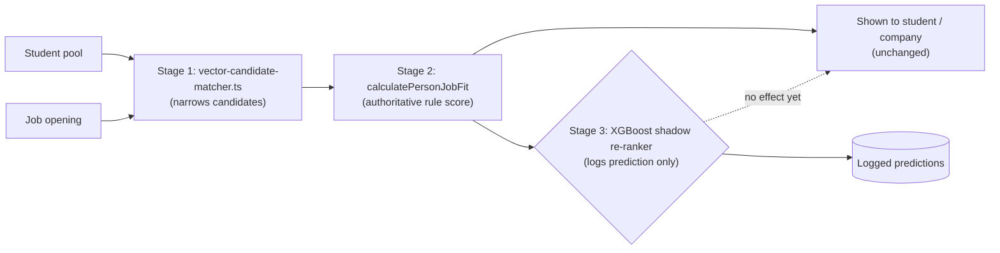
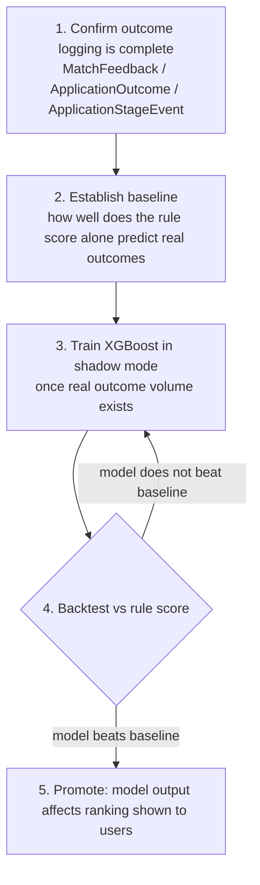

# Proposal: XGBoost Re-Ranker for Candidate Matching

## 1. What we have today

Our matching pipeline (`matching.service.ts`) already runs in two stages:

1. **Stage 1 — Vector narrow**: `vector-candidate-matcher.ts` shortlists candidates from the full pool via cosine similarity over an explainable 6-dim vector (5 domain-competency axes A-E + tier weight), so every shortlist decision can be read back per-axis on the radar chart. `CandidateEmbeddingService` (S8-RM-XX) separately generates and persists a real 1536-dim pgvector embedding per candidate (`CandidateEvidenceProfile.embedding`, via Google's `text-embedding-004`) for future semantic-similarity ranking, but that embedding is not yet consulted by the live Stage 1 ranking query — see `docs/proposal-xgboost-reranker.md` history or `candidate-embedding.service.ts`'s header comment for current status before assuming it's wired end-to-end.
2. **Stage 2 — Authoritative score**: `calculatePersonJobFit` (`person-job-fit.ts`) re-scores the shortlist with a deterministic, hand-weighted formula — proficiency accuracy × role weight × importance weight, skill token overlap, held-at-ask thresholds.

Every number this produces today traces back to a rule a person wrote. That is a deliberate strength: we can tell any student or company exactly why they were or weren't matched. We should not give that up.

## 2. The problem we're solving

As we add more signals per student and per job (new assessment types, project/Qlix evidence, company culture fit, recruiter feedback), hand-tuning fixed weights for every new signal and every interaction between signals stops being feasible. A person can reason about 8–10 weights; not about 30+ weights with interaction effects (e.g. "proficiency should matter more for senior roles, less for junior ones").

We already collect the data needed to learn these interactions instead of hand-tuning them:

- `MatchFeedback` — employer rating + "irrelevant reasons" per match
- `ApplicationOutcome` — offer accepted/declined, joined/no-show
- `ApplicationStageEvent` — full funnel history per application
- `ApplicationSnapshot.fitJson` — the rule score frozen at the moment someone applied, so we can check it against what actually happened

This is exactly the kind of labeled data a model needs to be trained — and evaluated honestly — against.

## 3. Why XGBoost, not a neural network

We considered a neural network for this and ruled it out for this specific use case:

|                               | Neural net                                                      | XGBoost                                                                    |
| ----------------------------- | --------------------------------------------------------------- | -------------------------------------------------------------------------- |
| Explainability                | Approximate, after the fact (SHAP/LIME), can shift between runs | Exact — SHAP decomposition on trees is exact, not estimated                |
| Data needed                   | Tens of thousands+ rows to avoid overfitting                    | Works with low thousands of rows                                           |
| Fairness guardrails           | Hard to enforce                                                 | Can force "this factor can never lower your score" (monotonic constraints) |
| Fits hiring decisions legally | Weak — opaque by default                                        | Strong — every score traces to named, auditable factors                    |

Hiring-adjacent scoring is treated as high-risk and explainability-sensitive in most relevant regulation (e.g. EU AI Act, US EEOC guidance on algorithmic hiring tools). "A statistical estimate of why the model decided this" is a materially weaker position than "here is the exact contribution of each factor." XGBoost gives us the second one. A neural net only gives us the first, and only after extra tooling.

We already use a neural net in one place — the embedding model — but only to _narrow_ the pool in Stage 1, never to produce the number a person sees. That split (neural net for representation, interpretable model for the decision) is the right line to hold, and this proposal keeps it.

## 4. Why this choice is mainly about justification, not accuracy

We want to be direct about the actual reason we are picking XGBoost over a neural net: it is not primarily about which one scores higher. It is about which one we can defend. For a platform whose core promise is _why this match happened_, that is the deciding factor, and it would still be the deciding factor even if a neural net turned out to be slightly more accurate.

- **A neural net's "reason" for a decision is not localized anywhere.** With `calculatePersonJobFit` today, we can point at the exact line: 0.3 × proficiency + 0.4 × role weight. A neural net's decision comes from a pattern spread across thousands of weights interacting with each other — there is no single weight or neuron we can point to and say "that's why." Tools like SHAP or attention maps only give us an _estimate_ of the reason, built after the decision was already made, and that estimate can change if we re-run it. For a student asking "why wasn't I matched" or a company asking "why was this candidate ranked first," an estimate of an estimate is not an answer we can stand behind.
- **XGBoost does not have this problem by construction.** Its decisions are a sequence of explicit, readable splits ("if proficiency < X and role seniority > Y, then..."), so the contribution of every factor to every score is something we can calculate exactly, not approximate. We can print it, store it, and hand it to a person without hedging.
- **This matters legally, not just as a nice-to-have.** Algorithmic hiring tools are treated as high-risk and subject to explainability obligations under frameworks like the EU AI Act, and under US EEOC guidance on adverse impact in hiring. Regulators and courts generally do not treat a post-hoc approximation of a black box as equivalent to genuine interpretability. Choosing a model we cannot fully explain would put us in a weaker position than our current rule-based system, even if it were more "accurate" on paper.
- **Fairness guarantees need to be structural, not hoped-for.** With XGBoost we can set monotonic constraints — e.g. force "more proficiency can never lower your score" — directly into how the model is built. A neural net has no equivalent built-in guarantee; you would have to test for it after training and hope it held, rather than enforce it by design.
- **"Correct but unexplainable" is not good enough for us.** Even in the best case where a neural net is right more often, if we cannot say _why_ it was right in a way a student or company can understand and a regulator can accept, it doesn't fit how this platform is supposed to work. We are choosing the model that lets every score stay something we can justify, by design, every time — not just one that happens to perform well.

## 5. Where it sits in the architecture

```
Stage 1 (existing, unchanged)
  vector-candidate-matcher.ts → narrows candidate pool

Stage 2 (existing, unchanged)
  calculatePersonJobFit → deterministic rule score ("authoritative" score)

Stage 3 (new)
  ml-rerank.service.ts
    - Input: Stage 2's score + its component sub-scores
      (proficiency accuracy, role weight, importance weight,
       skill overlap, Stage 1 embedding similarity)
    - Output: a re-rank signal, logged alongside the existing score
    - Runs in SHADOW MODE at first: it never changes what a
      student or company sees. It only logs its own prediction
      next to the real outcome, so we can check its accuracy
      before trusting it with anything.
```

Nothing about Stage 1 or Stage 2 changes. The new model consumes their output; it does not replace them, and the rule-based score stays the one that is shown and defended.

## 6. Expected benefit — and the honest caveat

Based on how similar re-ranking layers perform in recruiting/matching systems generally, a learned re-ranker on top of a solid rule-based score typically improves ranking quality (e.g. "did the top candidates actually get interviewed/hired") by roughly **5–15%**. This is a reasonable range to expect, not a number we can promise — we have not yet measured it on our own data, and we should not claim this benefit in writing or to stakeholders until we have.

The real blocker right now is not the model, it's **volume of real outcomes**. We currently only have a synthetic seed dataset (~200 students, for load testing). A model trained on that will either copy the existing rules or overfit to noise — it will not teach us anything new. The actual sequence should be:

1. **Confirm outcome logging is complete** — every match that runs through `matching.service.ts` should reliably produce a `MatchFeedback` / `ApplicationOutcome` / `ApplicationStageEvent` row, with `ApplicationSnapshot.fitJson` frozen at apply time. This is an engineering task we can do now, independent of the model.
2. **Establish a baseline** — once we have even a modest number of real outcomes, measure how well the existing rule score alone predicts them. This tells us how much room there even is to improve.
3. **Train the shadow model** — once we have a few thousand real labeled matches, train XGBoost as described below and run it in shadow mode.
4. **Promote only after backtesting** — only move the model from "logging in the background" to "affecting what people see" once it beats the rule score on real outcomes in backtesting, not just on paper.

## 7. Starting configuration

```python
import lightgbm as lgb  # LightGBM, same explainability properties as XGBoost, more sample-efficient at small data sizes

params = {
    "objective": "lambdarank",        # we are ranking candidates per job, not scoring in isolation
    "metric": "ndcg",
    "ndcg_eval_at": [5, 10, 20],       # match our real shortlist sizes
    "num_leaves": 15,                 # shallow trees — guards against overfitting on limited data
    "max_depth": 4,
    "learning_rate": 0.05,
    "min_data_in_leaf": 20,
    "monotone_constraints": [1, 1, 1, 0, 1],
      # e.g. +1 on proficiency, role weight, importance weight:
      # these can only ever help a candidate's score, never hurt it —
      # this is our fairness guardrail, enforced by the model's structure, not just hoped for
    "num_boost_round": 200,
    "early_stopping_rounds": 20,      # stop before the model starts memorizing instead of learning
}
```

Retraining should run as a scheduled weekly batch job against accumulated outcome data — not continuous/online learning. Batch retraining is easier to audit, easier to roll back, and appropriate for the volume of data we'll realistically have for some time.

## 8. Implementation flow (minimal diagram)

**Architecture — where Stage 3 sits:**



**Rollout sequence — the order work actually happens in:**



Nothing in Stage 1 or Stage 2 changes at any point in this sequence — the diagram is entirely about what gets added alongside them, and when.

## 9. What we are asking for

- Approval to confirm/complete outcome-logging coverage across the matching pipeline (no model work yet — this alone has value for analytics).
- Approval to build the Stage 3 shadow re-ranker once we have a working baseline, strictly in shadow mode, with no change to what students or companies see until it is validated against real outcomes.
- Agreement that promotion out of shadow mode requires a documented backtest showing improvement over the current rule-based score — not just a lower training loss.
